# Main Heading

|                            |                                                                                                                                                                              |
|:--------------------------:|:---------------------------------------------------------------------------------------------------------------------------------------------------------------------------- |
| Date                       | 09/12/2024                                                                                                                                                                   |
| Tester                     | Jeff Osundwa                                                                                                                                                                 |
| Documentation              | [Link](https://)                                                                                                                                                             |
| Test System Specifications |  |
| Test Description           | Description of work required - Follow the API guide outlined in the documentation and perform the steps to see if the correct output is received                             |

### Result Key

🟢 = Pass / Output as expected  
🟡 = Output received but not what was expected / Process failed one or more times before pass  
🔴 = Fail / Could not process  
⚠️ = Error / Crash  

> *All images in the table below can be clicked on to get an enlarged view of the image*

### Tests Results

| No  | Description                          | Status | Notes                                                                                                                                         |
|:---:|:------------------------------------ |:------:|:--------------------------------------------------------------------------------------------------------------------------------------------- |
| 1   | **Coverage search**                  | 🟢     |                                                                                                                                               |
|     | `COLOR_COMPOSITION` `MASK`: Auto | 🟢     | 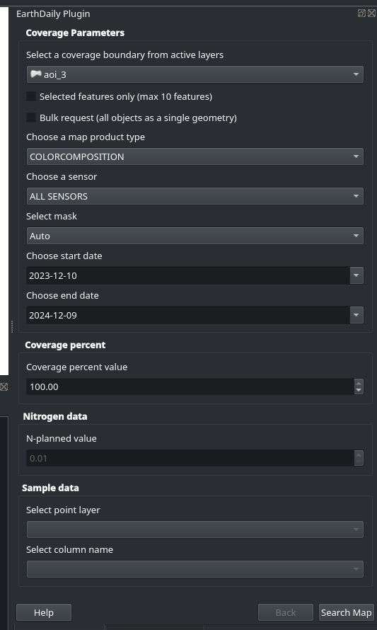                                                                                                              |
|     | Result:                              | 🟢     | Output `200 OK`   [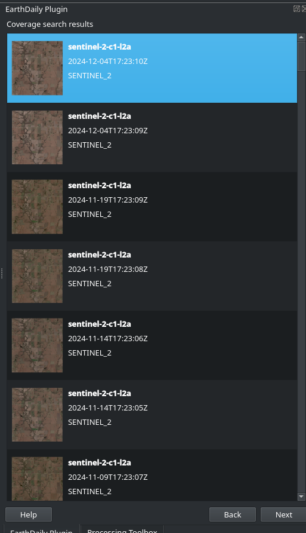](https://github.com/user-attachments/assets/cf2487ae-68ba-45e9-abab-c6e7280cc39a) |
|     | `MASK`: None                         | 🟢     | 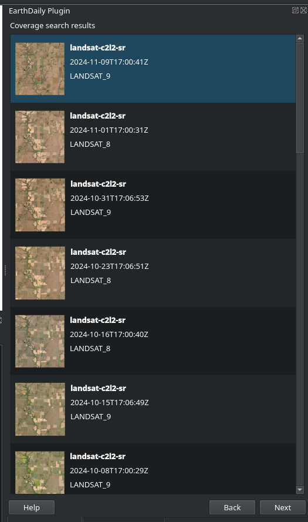                                                                                                              |
|     | `MASK`: ACM                          | 🟢     | 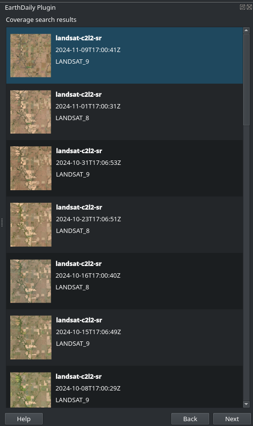                                                                                                              |
|     | `MASK`: All                          | 🟢     | 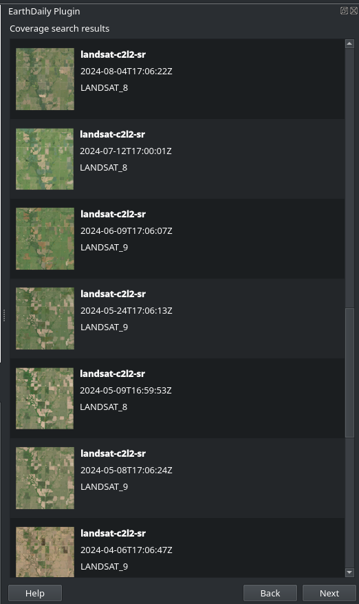                                                                                                              |
|     | `MASK`: Native                       | 🟢     | 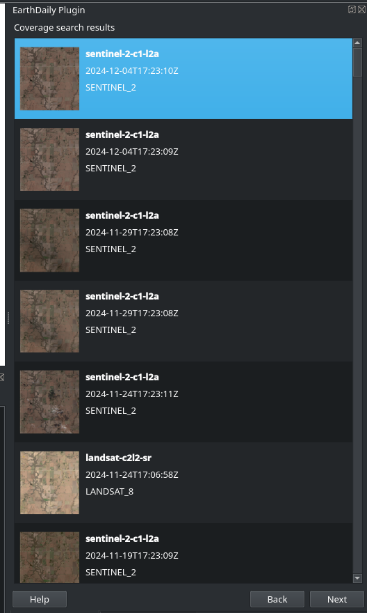                                                                                                              |
| 2   | **Coverage search**                  |        |                                                                                                                                               |
|     | CVI                                  | 🟢     | 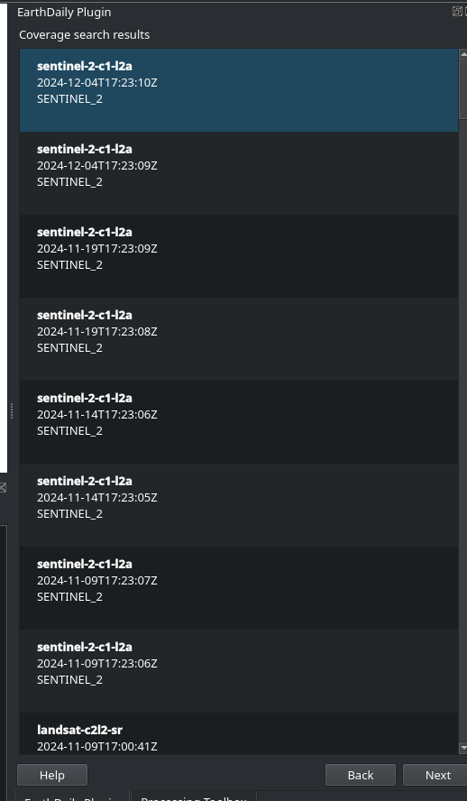                                                                                                                   |
|     | CVIN                                 | 🟢     | 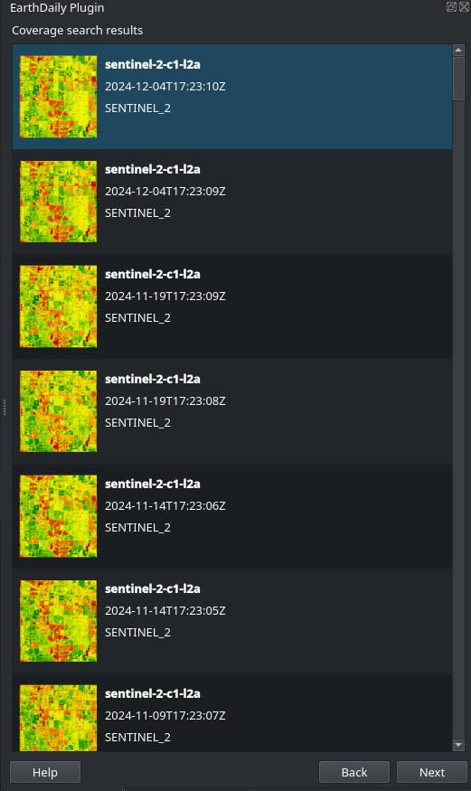                                                                                                                           |
|     | Elevation                            | 🟢     | png: 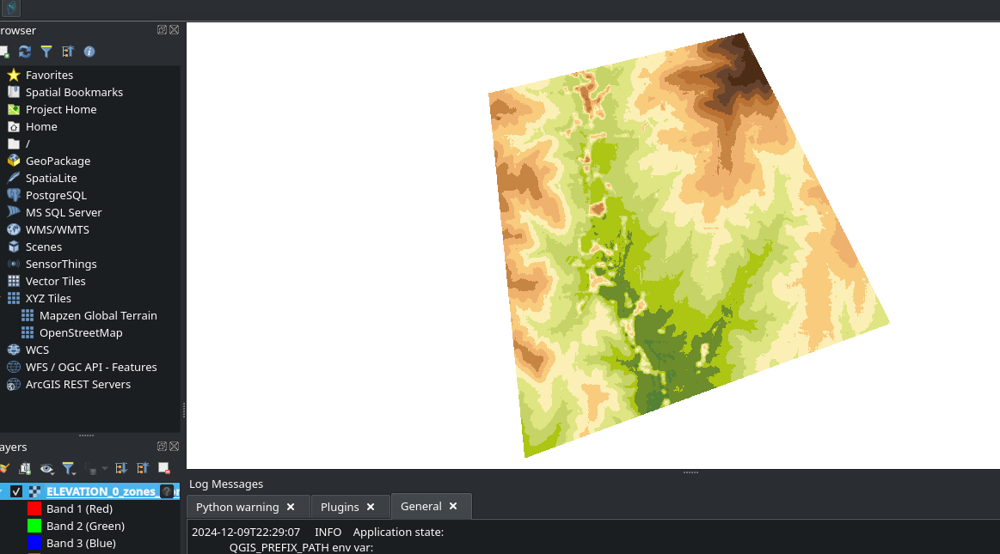                                                                                                                 |
|     | EVI                                  | 🟢     | 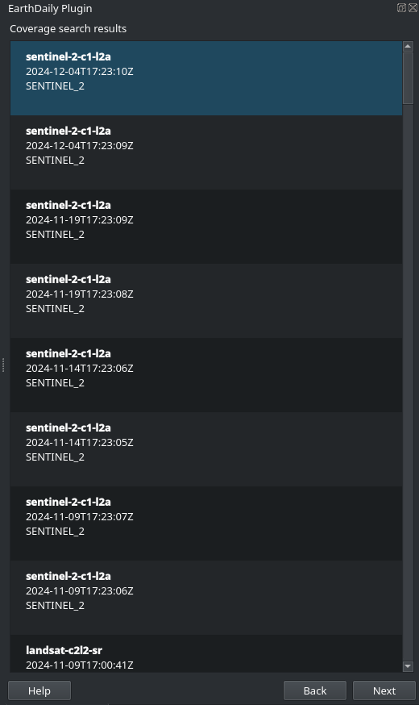                                                                                                                            |
|     |                                      | 🔴     | Download EVI failed 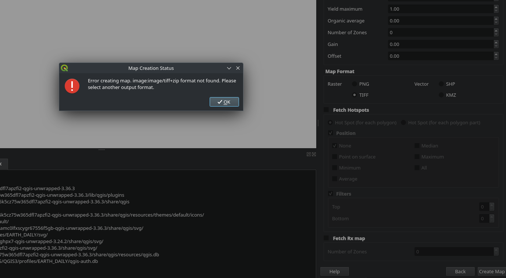                                                                                                    |
|     | GNDVI                                | 🟢     | Coverage: 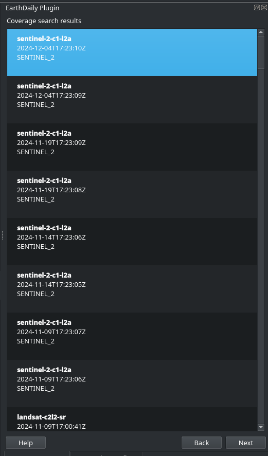                                                                                                             |
|     |                                      | 🔴     | Download: 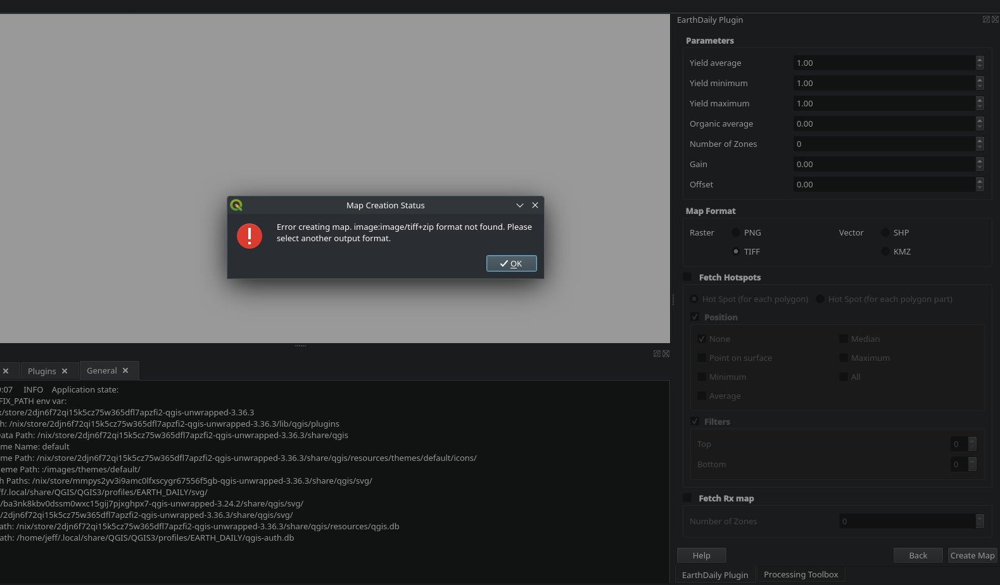                                                                                                             |
|     | NDMI                                 | 🔴     | Download:                                                                                                              |
| 3   | `SAMPLEMAP`                          | 🔴     | 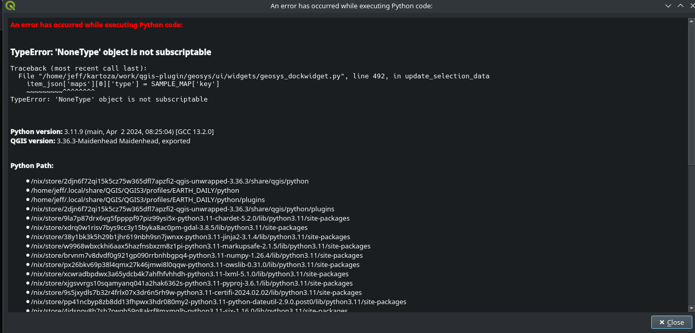                                                                                                                      |
|     |                                      |        | Error handling. When Sample point is not selected. It throws the error.   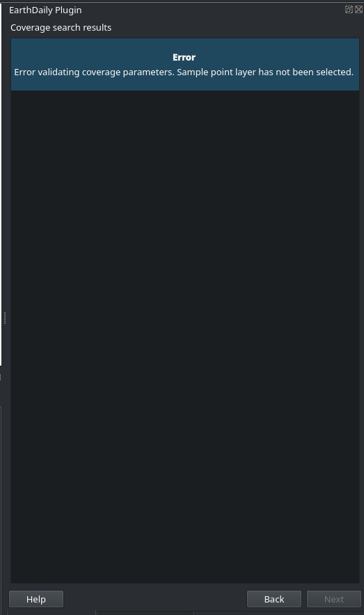                    |
| 4   | YGM                                  | 🟢     | 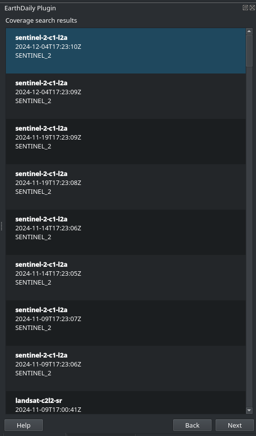                                                                                                                            |
| 5   | YPM                                  | 🔴     | 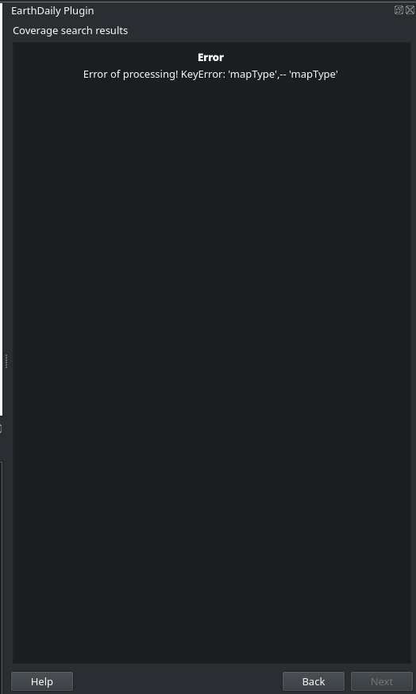                                                                                                                            |
|     | SAMZ                                 | 🔴     | Download `.tiff` 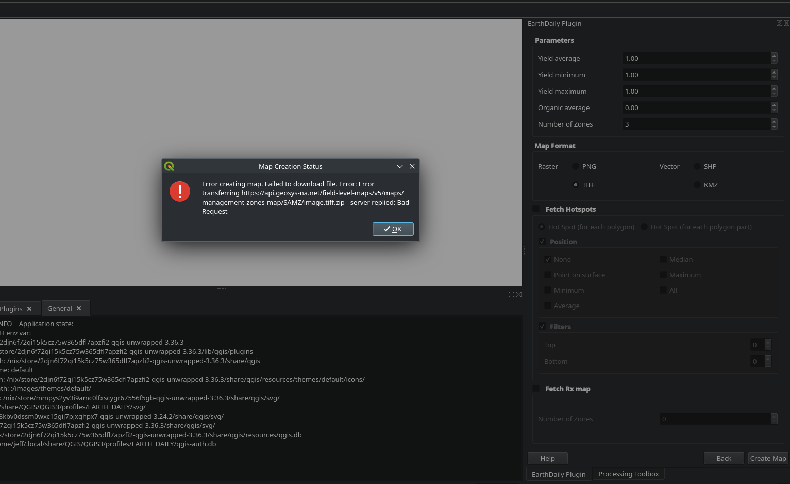                                                                                                      |
|     |                                      | 🔴     | Download `.shp` 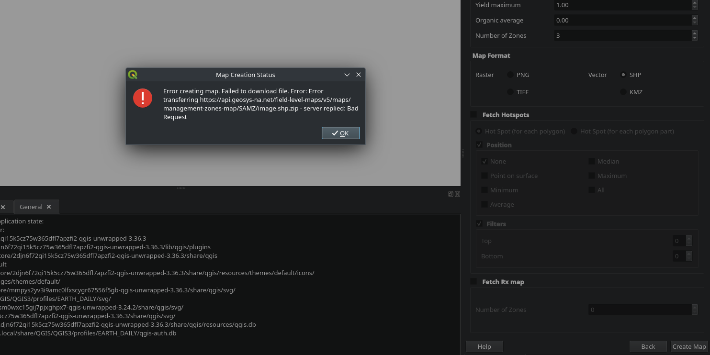                                                                                                       |
|     | RX                                   | 🟡     | Download looks odd 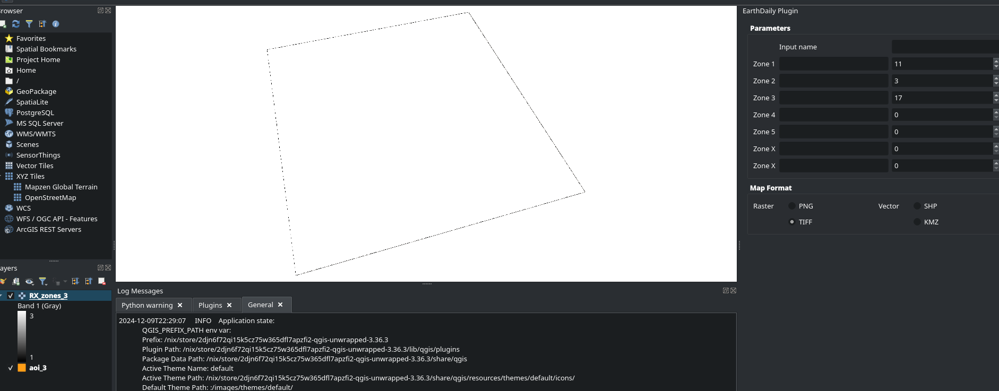                                                                                                      |
|     |                                      |        |                                                                                                                                               |